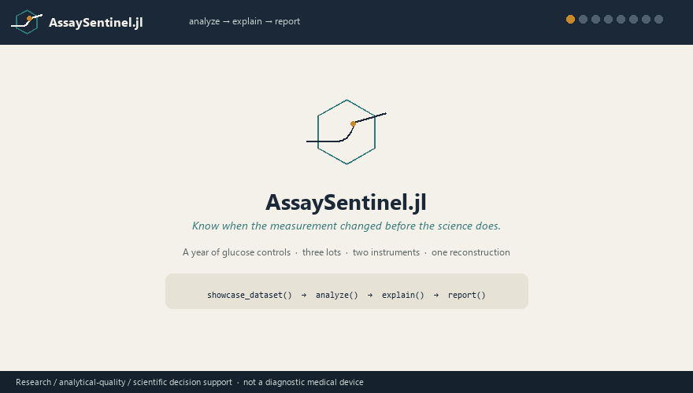
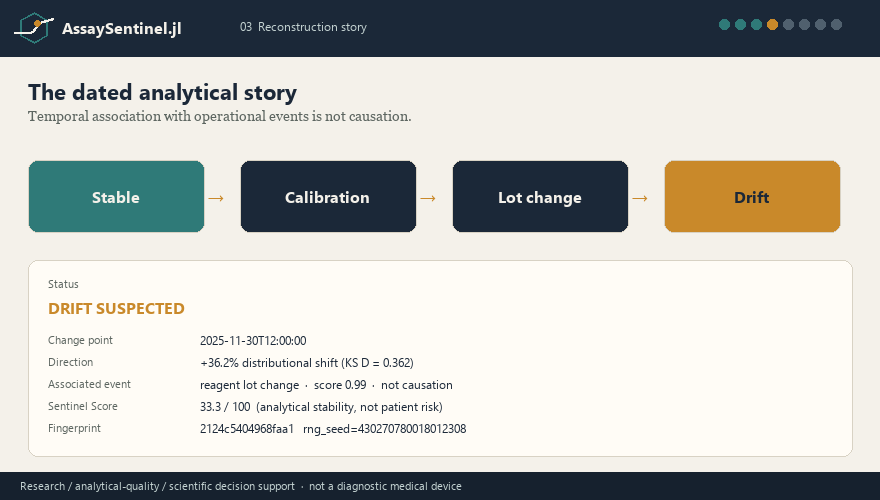
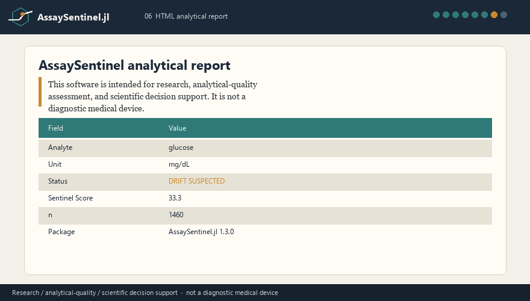
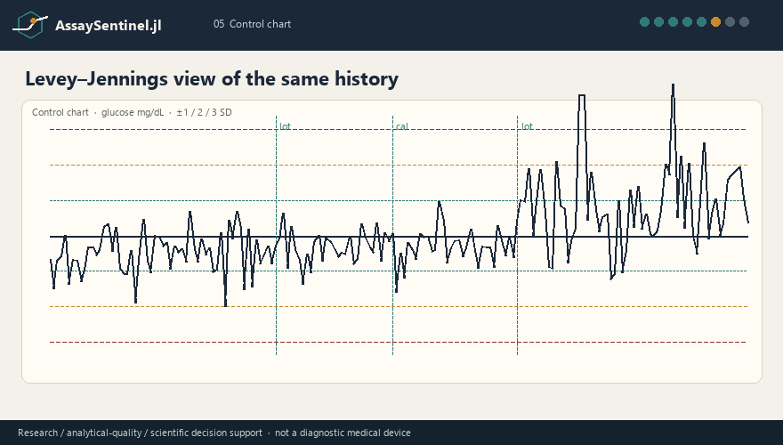

<p align="center">
  
</p>

<h1 align="center">AssaySentinel.jl</h1>

<p align="center">
  <strong>Know when the measurement changed<br/>before the science does.</strong>
</p>

<p align="center">
  A Julia instrument for scientists and laboratory physicians who need to know<br/>
  whether the <em>measurement process</em> changed — instruments, lots, calibrations,<br/>
  batches, and QC — and to reconstruct that conclusion later.
</p>

<p align="center">
  <a href="https://github.com/theworker02/AssaySentinel.jl/actions/workflows/ci.yml"></a>
  <a href="https://github.com/theworker02/AssaySentinel.jl/actions/workflows/docs.yml"></a>
  <a href="https://theworker02.github.io/AssaySentinel.jl/"></a>
  <a href="https://theworker02.github.io/AssaySentinel.jl/"></a>
  <a href="https://github.com/theworker02/AssaySentinel.jl/releases/tag/v1.3.0"></a>
  <a href="LICENSE"></a>
  <a href="#julia-compatibility"></a>
  <a href="#safety-boundary"></a>
  <a href="https://github.com/theworker02/AssaySentinel.jl"></a>
  <a href="https://thanks.dev/u/gh/theworker02"></a>
  <a href="CHANGELOG.md"></a>
</p>

<p align="center">
  <a href="#in-practice">Quick start</a> ·
  <a href="https://theworker02.github.io/AssaySentinel.jl">Docs</a> ·
  <a href="STATISTICAL_METHODS.md">Methods</a> ·
  <a href="VALIDATION.md">Validation</a> ·
  <a href="https://github.com/sponsors/theworker02">Sponsors</a> ·
  <a href="https://thanks.dev/u/gh/theworker02">thanks.dev</a>
</p>

<p align="center">
  
</p>

---

## Who this is for

AssaySentinel is written for people who already know that a result is only as
trustworthy as the process that produced it:

- **Scientists** running longitudinal assays, method studies, or multi-instrument programs
- **Assay developers** watching reagent lots, calibrators, and transfer protocols
- **Clinical laboratory researchers** investigating QC, bias, and process capability
- **Biostatisticians** who need dated change-points with an uncertainty budget
- **Physicians** doing measurement-quality, method-comparison, or laboratory research work

It answers a laboratory question: *did the measurement system change, when, in
what direction, with what uncertainty, and can that conclusion be reconstructed?*

It does not answer a clinical question about a patient.

## Safety boundary

> This software is intended for research, analytical-quality assessment, method
> development, and scientific decision support. It is not a diagnostic medical
> device and must not independently determine patient diagnosis or treatment.

Severity labels (`info`, `watch`, `warning`, `critical`) and the Sentinel Score
describe the **analytical process**, not clinical risk. AssaySentinel will not
attach a disease name to a patient result.

## How it works

A scientist drops a measurement history in. AssaySentinel runs an explainable
detector bank, then returns a reconstruction — a dated story, an uncertainty
budget, charts, and a provenance graph — through `explain` and `report`.

<p align="center">
  
</p>

Detectors include CUSUM, PELT, Bayesian product-partition change-points,
Westgard-style QC, calibration events, and lot / instrument comparisons.
`:auto` states *why* a method was selected. Temporal association with a lot
change or calibration is reported as association, never as causation.

## The reconstruction promise

Every `analyze` call is expected to be:

| Promise | What you actually get |
| --- | --- |
| **Reproducible** | `rng` seed and input fingerprint travel with the conclusion |
| **Uncertainty-aware** | combined SD, RMS(u), weighted mean, magnitude standard error |
| **Plotted** | control chart, reconstruction timeline, lot / instrument strips, provenance |
| **Provenance-complete** | ingest → outliers → change-point → drift → reconstruct, each tagged `[observed]`, `[statistical]`, `[algorithmic]`, or `[annotation]` |

The pedagogical chain scientists read first is:

**Stable → Calibration → Lot change → Drift**

`explain` then shows the dated beats the detectors actually reconstructed on
*this* history. That second story is allowed to be messier. The data are.

<p align="center">
  
</p>

## In practice

```julia
using AssaySentinel

data = showcase_dataset()
result = analyze(data.stream)
println(result)
explain(result)
report(result, "assay-report.html")
```

`showcase_dataset()` is twelve months of synthetic glucose controls: three
reagent lots, two instruments, a calibration event, gradual drift, a variance
shift, and a handful of control failures. The HTML report is the same object
`explain` narrates — cream page, navy type, teal/amber charts, safety notice
on the first screen.

From any Tables.jl source (DataFrames is not required internally):

```julia
result = analyze(
    Assay(name = "Example Assay", analyte = :analyte_x, unit = "mg/dL"),
    table;
    value = :result,
    time = :timestamp,
    lot = :reagent_lot,
    instrument = :instrument,
)
```

Multi-site histories go through the same reconstruction path:

```julia
srep = analyze(study, Dict("Lab-A" => stream_a, "Lab-B" => stream_b))
explain(srep)
report(srep, "study-report.html")  # forest plot + per-site charts
```

Sharing labels (`:global`, `:site_specific`, `:mixed`, `:stable`) and I²
describe statistical concordance across sites, not a cause.

<p align="center">
  
  <br/>
  
</p>

## Install

Julia 1.10 or newer. Until the package is on the General registry, add it from GitHub:

```julia
using Pkg
Pkg.add(url="https://github.com/theworker02/AssaySentinel.jl")
```

Registration is pending ([General PR #164654](https://github.com/JuliaRegistries/General/pull/164654)).
After that merge, the usual name install will work:

```julia
using Pkg
Pkg.add("AssaySentinel")   # after General registration
```

The core package is **stdlib-only**. Makie, Unitful, Measurements, OnlineStats,
and Turing are optional extensions. They are never required to analyze, explain,
or write a report. The package is **not** on JuliaHub until General merges;
do not expect a JuliaHub page yet.

## Scope

| Area | Entry points |
| --- | --- |
| Drift / change points | `detect_drift`, `detect_changes` (`:auto` explains its choice) |
| QC | `monitor`, `westgard_rules`, `@qcrule`, Levey–Jennings data |
| Calibration | `calibrate`, `compare_calibrations` |
| Batches | `detect_batch_effects`, `correct_batch_effects` (opt-in only) |
| Comparison | `compare_methods`, `compare_instruments`, `compare_lots`, `compare_sites` |
| Reference limits | `reference_interval`, `assess_partitions`, `reference_curve` |
| Streaming | `Sentinel`, `update!`, `onalert` |
| Simulation | `simulate_assay`, `evaluate_detector`, `showcase_dataset` |
| Provenance | `explain`, `save`, `report` |

Correction is never implied by detection. Outliers are annotated, not silently
deleted. Incompatible units are never compared without an explicit conversion.

## Design principles

1. Measurements are systems, not bare numbers.
2. Prefer explainable statistics over black-box scores.
3. Detection and correction are separate.
4. Outliers are annotated, not silently deleted.
5. Missing and NaN are never coerced to zero.
6. Incompatible units are never compared without an explicit conversion.
7. Temporal association is not causation.
8. Every conclusion should be reproducible (`rng`, fingerprints, provenance).

## Julia compatibility

AssaySentinel targets **Julia 1.10+** (LTS and current stable).

## CLI

```bash
julia --project bin/assaysentinel analyze measurements.csv
julia --project bin/assaysentinel doctor
julia --project bin/assaysentinel version
```

JSON output: add `--json`.

## Documentation and methods

- [Published docs](https://theworker02.github.io/AssaySentinel.jl)
- [`STATISTICAL_METHODS.md`](STATISTICAL_METHODS.md) — estimators, penalties, and citations
- [`VALIDATION.md`](VALIDATION.md) — what has been checked, and what has not
- [`CHANGELOG.md`](CHANGELOG.md)

## Repository assets

Canonical mark: [`assets/logo.svg`](assets/logo.svg) (dark/light variants alongside).
GitHub icons: `assets/icon.png`, `assets/icon-256.png`, `assets/icon-512.png`.
Social card: [`assets/social-preview.png`](assets/social-preview.png).
Architecture: [`assets/how-it-works.svg`](assets/how-it-works.svg).
Walkthrough: [`assets/demo.gif`](assets/demo.gif).

## Citation

See [`CITATION.cff`](CITATION.cff). If you use AssaySentinel in research,
please cite the package and the statistical methods you invoked
([`STATISTICAL_METHODS.md`](STATISTICAL_METHODS.md)).

## Sponsors

[GitHub Sponsors](https://github.com/sponsors/theworker02) ·
[thanks.dev/u/gh/theworker02](https://thanks.dev/u/gh/theworker02)

## License

[MIT](LICENSE) © 2026 AssaySentinel Contributors
